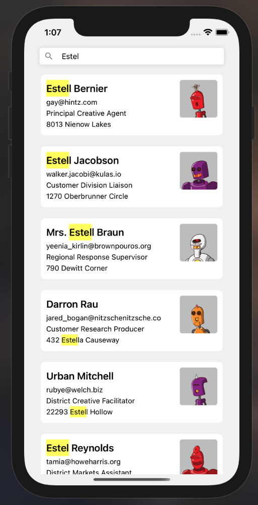

## Profile search: React Native

### Getting started

1. Follow the [React Native guide](https://facebook.github.io/react-native/docs/getting-started.html) to set up the tools you'll need in your developer environment.
2. cd profile-search-RN && yarn
3. cd ios && pod install && cd..
4. yarn ios/android
